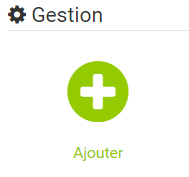
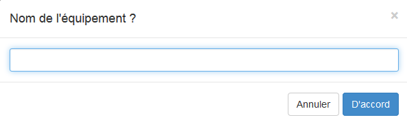
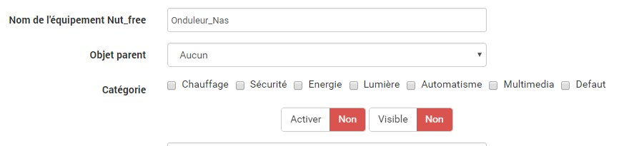
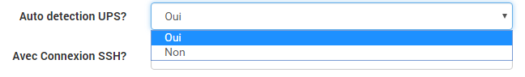
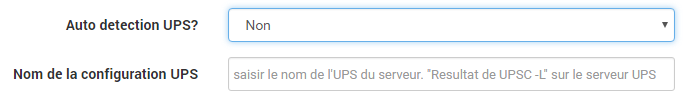
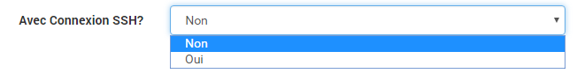
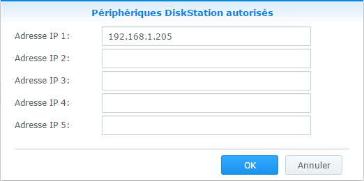
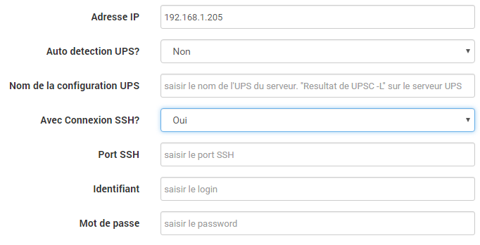
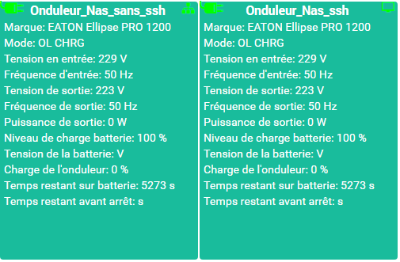

Nous allons maintenant paramétrer un équipement. Pour se faire, cliquer sur *Plugins  / Monitoring / Nut_free*

Puis cliquer sur le bouton en haut à gauche *Ajouter*

Puis saisir le nom de l'équipement (ex. Onduleur_Nas) 

**Puis définir :**

- Objet parent
- Catégorie (optionnelle)
- Activer (à cocher, sinon l'équipement ne sera pas utilisable)
- Visible (optionel si vous ne désirez pas le rendre visible sur le Dashboard)

**Adresse IP:** IP du serveur NUT distant

**Nom de la configuration UPS:** Nom de l'onduleur à surveiller vu par NUT ( Résultat de la commande upsc -l).
- Si il y a 1 seul onduleur sur le serveur NUT, l'est pas utile de renseigner le champs.Le plugin trouvera seul le nom.
- Si il y a plusieurs onduleur, il faudra connaitre le nom et le renseigner.

**Auto detectetion de l'UPS:**

Si il y a seulement 1 onduleur sur le serveur Nut, laisser sur oui.
sinon mettre sur non et renseigner l'onduleur à surveiller.

le type de connexion au serveur NUT:

**Non :**
Sans connexion ssh.
Dialogue direct avec le serveur nut via l'IP et le port de communincation standard de NUT

## IMPORTANT ##
Vous devez choisir un identifiant avec les droits nécessaires pour lancer les commandes (en général le login "root").

Pour un NAS Synology:
- il faut utiliser le login "root" et le mot de passe de votre compte "admin"
- il faut autoriser l'IP du jeedom à récupérer les info de l'onduleur. 
Aller dans le "Panneau de configuration" => "Matériel et alimentation" => "UPS" => "Périphériques DiskStation autorisés"

**Oui :**
Cela signifi avec connexion ssh. Dans ce ca renseigner:

Aprés avoir sélectionné ce mode, 3 champs supplémentaires s'affichent :

-**Port SSH:** saisir le numéro du port SSH (par défaut il s'agit du port 22)

-**Identifiant:** saisir le nom d'utilisateur qui sera utilisé pour lancer les commandes Linux

-**Mot de passe:** saisir le mot de passe qui est associé au nom d'utilisateur

## IMPORTANT ##
Vous devez choisir un identifiant avec les droits nécessaires pour lancer les commandes (en général le login "root").

Pour un NAS Synology:
- il faut utiliser le login "root" et le mot de passe de votre compte "admin"
- il faut autoriser l'IP du jeedom à recuperer les info de l'onduleur. 
Aller dans le "Panneau de configuration" => "Matériel et alimentation" => "UPS" => "Périphériques DiskStation autorisés"

## Historiser ##
Pour certaines valeurs, il est possible d'activer "historiser" pour représenter, par une courbe, les variations de différentes valeurs.

## Quelques captures ##

